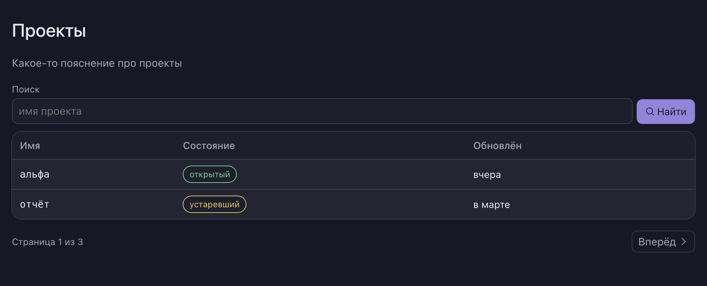

# oscript-ui

UI-кит для веб-приложений на чистом [OneScript](https://oscript.io): компоненты,
каркас форм, дерево узлов экрана, токены темы, иконки и собственный базовый лист стилей.
Классы кита — желуди [ОСени](https://github.com/autumn-library/autumn), но зависимости
на неё у библиотеки нет.

**Зачем.** Чтобы можно было декларативно рисовать веб-приложения на оскрипте.

**Из коробки.** Поставленный в чужой проект, кит выглядит прилично без единой строки
CSS от потребителя. Всё, что проект хочет изменить — правило, файл статики, палитру, —
он переопределяет штатно, не трогая библиотеку: своё правило вторым листом в каскаде,
свой файл одноимённым объявлением, свою тему и акцент контрактом оформления.

**Одна навигация.** Инсталляция описывает свои дороги ОДИН раз — слотом `МенюХаба`
в обрамлении, — а кит показывает их по ширине экрана. На широком шапка выглядит как
обычно: знак, дороги, переключатель оформления и учётка справа; учётка же и открывает
панель. На телефоне полоса ходов прячется, слева появляется бургер, и панель выезжает
шторкой на всю высоту. Панель одна на обе ширины и содержимое несёт одно: учётка,
дела с числами, дороги, разделы текущего экрана, тема и выход. Выглядит она по месту:
на широком — компактным выпадающим меню у кнопки, на телефоне — шторкой с крестом.
Открытие, закрытие, Esc и щелчок мимо делает движок браузера — скрипта в ките нет
ни строки. Слот не заполнен — шапка остаётся прежней целиком, до последнего байта.

**Известный долг.** Компонент «Меню» (меню строки и учётки) выдаёт идентификаторы панелей
сквозным счётчиком процесса, поэтому страница со строчным меню от запроса к запросу
отдаёт разную разметку — побайтовое сравнение ответов на ней не работает. Единого меню
инсталляции это не касается: его идентификатор постоянен. Подробности — в комментарии
у счётчика идентификаторов, `src/Классы/компоненты/Меню.os`, функция
`СледующийИдентификатор`.

## Установка

```
opm install oscript-ui
```

В `packagedef` приложения:

```bsl
.ЗависитОт("oscript-ui", "0.5.1")
```

И подключаем:

```bsl
#Использовать oscript-ui
```

## Мини-пример

```bsl
// Весь экран собирается через него
Кит = Поделка.НайтиЖелудь("Кит");

// Холст — прозрачная группировка. на холсте мы размещаем наши элементы
Холст = Кит.Холст();

// Заголовок страницы и пояснение под ним
Холст.Добавить(Кит.ЗаголовокСтраницы(Новый Структура("Заголовок, Пояснение",
	"Проекты", "Какое-то пояснение про проекты")));

// Поиск — готовая GET-форма: js нет, по кнопке запрос улетает на сервер.
Холст.Добавить(Кит.СтрокаПоиска(Новый Структура("Действие, Метка, Плейсхолдер, Кнопка, Иконка",
	"/проекты", "Поиск", "имя проекта", "Найти", "поиск")));

// Рисуем таблицу.
Таблица = Холст.Добавить(Кит.Таблица());
Таблица.Добавить(Кит.Колонка("Имя"));
Таблица.Добавить(Кит.Колонка("Состояние"));
Таблица.Добавить(Кит.Колонка("Обновлён"));
// Если в таблице строк нет - напишем так.
Таблица.Пусто().Добавить(Кит.Примечание("Ничего не найдено"));

// Какие-то данные для таблицы; состояние — сразу готовая модель плашки
Проекты = Новый Массив();
Проекты.Добавить(Новый Структура("Имя, Состояние, Обновлён",
	"альфа", Новый Структура("Текст, Вид", "открытый", "ok"), "вчера"));
Проекты.Добавить(Новый Структура("Имя, Состояние, Обновлён",
	"отчёт", Новый Структура("Текст, Вид", "устаревший", "warn"), "в марте"));

// Добавим записи таблицы
Для Каждого Проект Из Проекты Цикл
	Запись = Таблица.Добавить(Кит.Запись());
	Запись.Добавить(Кит.Ячейка()).Добавить(Кит.Код(Проект.Имя));
	Запись.Добавить(Кит.Ячейка()).Добавить(Кит.Плашка(Проект.Состояние));
	Запись.Добавить(Кит.Ячейка()).Добавить(Кит.Текст(Проект.Обновлён));
КонецЦикла;

// Под таблицей — пагинация.
Холст.Добавить(Кит.Пагинация(Новый Структура("Страница, ВсегоСтраниц, Основа",
	1, 3, "/проекты")));

// После построения - рендерим html.
HTML = Холст.Рендер();
```

С оформлением из коробки эта страница выглядит так:



Все вы восхитительны и только что нарисовали свое веб-приложение.

## Витрина

Всё остальное — кнопки во всех вариантах, поля и формы, карточки, меню, тосты,
пагинация, пустые состояния и каждый род узла — собрано в витрине:

```
oscript витрина.os
```

Команда кладёт рядом `витрина.html`, файл открывается браузером, сервера не нужно.
Под каждым образцом — не только картинка, но и **исходник, которым она нарисована**:
копируете кнопкой рядом с кодом, вставляете к себе — получаете ровно то, что видели.
Разойтись коду и картинке негде: витрина не хранит описаний, она исполняет исходник
и показывает результат.

Ключом `--стили путь.css` можно переопределить css своего проекта — и увидеть
витрину в его оформлении.

## Тесты

```
oneunit execute
```

## Лицензия

MIT. Иконки — набор [Phosphor](https://phosphoricons.com/), текст разрешения лежит
рядом с ними в `src/статика/иконки/phosphor-LICENSE.txt`.
