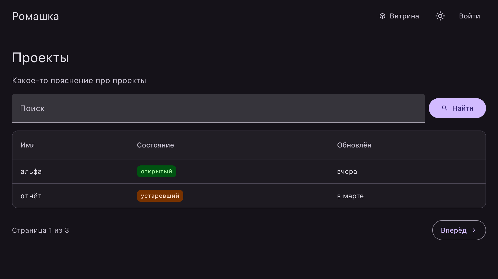

# oscript-ui

UI-кит для веб-приложений на чистом [OneScript](https://oscript.io): компоненты,
каркас форм, дерево узлов экрана, токены темы, иконки и собственный базовый лист стилей.
Классы кита — желуди [ОСени](https://github.com/autumn-library/autumn), но зависимости
на неё у библиотеки нет.

**Зачем.** Чтобы можно было декларативно рисовать веб-приложения на оскрипте.

**Облик — Material Design 3.** Кит не придумывает свой дизайн, а следует
[Material Design 3](https://m3.material.io) — системе Google, на которой стоит и MUI.
Цвета — роли M3, шрифт — её типографическая шкала, скругления, тени, слои состояний
и кривые движения — её токены (`--md-sys-*`), иконки — Material Symbols. Кнопки, поля,
флажки, переключатели, меню, ящик навигации, нижний лист, диалог, вкладки, чипы
и таблица нарисованы по её анатомии.

Вся схема цветов выводится из одного акцента. Акцент по умолчанию — базовый цвет M3
`#6750a4`; инсталляция и посетитель задают свой, и роли светлой и тёмной темы пересчитываются
из него на сервере. Контраст пар ролей держит таблица тонов, а не удачный выбор цвета.
Тест `ТемаMaterial` проверяет это на девяти акцентах, включая белый, чёрный и жёлтый.

Движение — как у MUI. Слой состояния на наведении, плавающая подпись поля и растущая
полоса фокуса, раскрытие меню из угла, выезд шторки и листа, проявление диалога,
раскрытие аккордеона — это CSS. Рябь от точки нажатия, пустота поля, тень шапки при
прокрутке и скольжение индикатора вкладок между страницами делает скрипт кита
`oscript-ui.js`. Каркас страницы подключает его сам, перед скриптом инсталляции.
Без скрипта страница работает целиком: подпись поля просто стоит наверху, а ряби нет.

Действия — без перезагрузки страницы. Раскрывашки и меню и так не ходят на сервер:
это `<details>` и popover. Тема меняется сразу: обе палитры уже в голове страницы, а
форма переключателя уходит на сервер в фоне. Форма, собранная с `БезПерезагрузки()`,
отправляется запросом, и ответ сервера ложится на страницу на место: прокрутка, фокус
и раскрытые раскрывашки остаются как были. Тумблер с `СохранятьСразу` сохраняет себя
сам. Серверу для этого ничего нового не нужно: он отвечает тем же перенаправлением
обратно на страницу, а без скрипта те же формы работают перезагрузкой.

Шрифт Material — Roboto. Кит его не везёт, как не везёт и MUI: где Roboto установлен
или подключён инсталляцией, страница говорит им, остальные видят системный гротеск.

Прежние имена переменных (`--color-*`, `--space-*`, `--radius-*`, `--shadow-*`,
`--font-*`) остаются псевдонимами ролей Material, поэтому лист инсталляции, написанный
под них, продолжает работать.

**Из коробки.** Поставленный в чужой проект, кит выглядит прилично без единой строки
CSS от потребителя. Всё, что проект хочет изменить — правило, файл статики, палитру, —
он переопределяет штатно, не трогая библиотеку: своё правило вторым листом в каскаде,
свой файл одноимённым объявлением, свою тему и акцент контрактом оформления.

**Одна навигация.** Инсталляция описывает свои дороги ОДИН раз — слотом `МенюХаба`
в обрамлении, — а кит показывает их по ширине экрана. На широком шапка выглядит как
обычно: знак, дороги, переключатель оформления и учётка справа; учётка же и открывает
панель. На телефоне полоса ходов прячется, слева появляется бургер, и панель выезжает
шторкой на всю высоту. Панель одна на обе ширины и содержимое несёт одно: учётка,
дела с числами, дороги, разделы текущего экрана, тема и выход. Выглядит она по месту:
на широком — компактным выпадающим меню у кнопки, на телефоне — шторкой с крестом.
Открытие, закрытие, Esc и щелчок мимо делает движок браузера — скрипта в ките нет
ни строки. Слот не заполнен — шапка остаётся прежней целиком, до последнего байта.

**Меню строки и учётки.** Шестерёнка в строке таблицы и кнопка-учётка — один компонент
`Меню`, и панель у них ведёт себя одинаково, по тем же правилам, что и единое меню.
На широком экране панель выпадает у самой кнопки, а места не хватит — отзеркаливается;
пункты идут строками списка, опасный узнаётся красной подписью. На телефоне панель
к кнопке не привязана: она встаёт листом у нижнего края окна, сверху подпись меню (чьи
это действия), пункты под палец, страница под листом затемнена. Вид пунктов задаёт меню:
ссылка, кнопка окна и форма из одной кнопки выглядят одинаково, какой бы вариант кнопки
ни пришёл от вызывающего; форма с полями остаётся формой.

**Таблица карточками.** `Кит.Таблица().Вид("карточками")` на узком экране (до 720 px) печатает
запись карточкой: шапки у неё нет, и ячейка сама несёт подпись своей колонки — приглушённой
строкой над значением. Подписи нет у первой, заглавной ячейки, у ячейки с меню строки
(на любой глубине) и у пустой; пустая ячейка на узком экране места не занимает. Колонка,
чьи значения называют себя сами («занято 12 КБ из 100», плашка «активна»), от подписи
отказывается явно — методом `Кит.Колонка("…").БезПодписиВЗаписи()`: подпись над таким
значением была бы дублем. Угадывать это по виду значения кит не берётся — плашка бывает
и состоянием, и названием.
Узкий столбец (`Кит.Ячейка().Вид("узкая")`) в записи растягивается на всю ширину карточки.

**Признак у имени.** Шапка объекта (`ШапкаОбъекта`) принимает в модели поле `Признаки` —
массив структур `Иконка, Подпись`. Каждый признак печатается значком сразу за именем,
в той же строке заголовка, а не в ряду плашек: глиф из набора иконок размером с букву
имени, по средней линии. Подпись обязательна: она печатается `<title>` значка
(`role="img"`) и служит сразу доступным именем и всплывающей подсказкой; признак без
подписи отвергается исключением, с неизвестным глифом — не печатается. Значок держится
за последний символ имени (класс `objhead__tail`, сам значок — `objhead__mark`) и на новую
строку один не уходит; перенос внутри имени прежний. Без признаков шапка печатается как
раньше, байт в байт.

**Известный долг.** Компонент «Меню» (меню строки и учётки) выдаёт идентификаторы панелей
сквозным счётчиком процесса, поэтому страница со строчным меню от запроса к запросу
отдаёт разную разметку — побайтовое сравнение ответов на ней не работает. Единого меню
инсталляции это не касается: его идентификатор постоянен. Подробности — в комментарии
у счётчика идентификаторов, `src/Классы/компоненты/Меню.os`, функция
`СледующийИдентификатор`.

## Переход на 0.10

**Язык узлов.** Экран пишется так, что по коду видно, что встанет на экран: позицией —
обязательное (текст заголовка и кнопки, адрес ссылки, имя и метка поля, вид ряда), дальше
до восьми детей аргументами, всё остальное — слова-методы цепочкой. Строка на месте узла —
текст (экранируется). `.Когда(Условие)` есть у любого узла. Таблица собирается из данных:
`Кит.Таблица(ТаблицаЗначений | Массив)`. Дом настроек и секция — узлы `Кит.ДомНастроек`
и `Кит.Секция`, адрес раздела и токен у дома задаются один раз. Тип поля — системой типов
OneScript: `.ТипЗначения(Тип("Число"))`, `ОписаниеТипов` с квалификаторами. Все правила
и словарь — страница документации «Язык узлов».

Разметка на выходе прежняя, байт в байт. Компоненты со структурой-моделью
(`Кит.Кнопка(Новый Структура(…))`) и строковый вход набора (`Набор.Кнопка().Отрисовать(…)`)
работают как раньше; прежние `Настройки.Отрисовать`, `Настройки.Раздел`, `Настройки.Секция`
и `ОбъявлениеФормы.Поле(Ключ, Метка, Вид, Свойства)` — тоже.

Ломается то, где позиционный смысл аргументов сменился: прежде вторым аргументом шёл вид
(или токен), теперь там ребёнок-текст. Строка, совпавшая с видом рода, и строка внутри
формы останавливают сборку исключением с подсказкой, поэтому прежний вызов не напечатает
слово «полоса» на экране молча.

| Было | Стало |
|---|---|
| `Кит.Область("полоса")`, `Статья`, `Раскрывашка`, `Список`, `Таблица`, `Запись`, `Ячейка`, `Надпись`, `Шапка`, `Основное`, `Подвал`, `Навигация` с видом | `Кит.Область(дети…).Вид("полоса")` |
| `Кит.Заголовок(2, "имя")`, `Кит.Ссылка(Адрес, "пилюля")`, `Кит.Группа(Подпись, "набор")`, `Кит.Примечание(Текст, "пусто")` | `Кит.Заголовок(2, текст…).Вид("имя")` и т. д.: второй аргумент — ребёнок |
| `Кит.Код(Текст, "блочный")`, `Кит.Картинка(Адрес, "значок")`, `Кит.Колонка(Подпись, "узкая")` | `Кит.Код(Текст).Вид("блочный")` и т. д. |
| `Кит.Форма(Адрес, Токен, Вид)` | `Кит.Форма(Адрес, дети…).Токен(Токен).Вид(Вид)`; токен можно задать и предку |
| `Кит.ФормаБезСессии(Адрес, Вид)`, `ФормаОтбора`, `ФормаБезТокена` | `Кит.ФормаБезСессии(Адрес, дети…).Вид(Вид)` |
| форма с относительным адресом печаталась как есть | дописывается к адресу раздела дома вокруг; без дома — исключение «форме нужен абсолютный адрес» |
| `Кит.Плашка(Модель)` и прочие компоненты рисовались сразу | рисуются на печати: ошибка модели (кнопка без подписи) приходит на `Рендер()` |
| у формы вошедшего скрытое поле CSRF было ребёнком в `Дети()` и `Дерево()` | поле печатается формой, ребёнком не числится |
| `ОбъявлениеФормы.Поле(…)` возвращало объявление | возвращает описание поля со словами; `Поле`, `Блок`, `Отрисовать`, `Разобрать` у описания передаются объявлению, цепочки работают |
| крошки дома печатались ссылкой у каждой крошки с адресом | крошки печатает компонент «Крошки»: последняя — текущая страница, текстом с `aria-current="page"`, её адрес не печатается |

Новые ключи словаря интерфейса: `form.error.date` — отказ нечитаемой даты; `chrome.crumbs` —
имя навигации крошек по умолчанию (у дома настроек остаётся `settings.frame.crumbs.label`).

**Единое меню: постоянный порядок групп.** Панель печатает группы в одном порядке на любой
странице: учётка, разделы текущего экрана, дороги (`Навигация`), дела, подвал. Группа,
которой нечего показать, не печатается, остальные не двигаются. Разделы экрана теперь
первая группа под учёткой, и заголовок у неё — имя экрана: у дома настроек его заголовок,
у страницы — `Заголовок` структуры `Заголовок, Разделы` четвёртым параметром
`Каркас.Страница` (массив, как прежде, подписан словарём). На широком экране в выпадающем
меню у кнопки-учётки спрятаны и разделы экрана, и дороги (`hubmenu__section--roads`):
дороги стоят в шапке. У любого пункта — `Счётчик` и `ПодписьСчётчика`; сумму на бургере
и кнопке-учётке, если инсталляция её не задала, кит складывает из числовых счётчиков дел.

**Дом настроек на телефоне.** Меню на телефоне одно — бургер: разделы дома встают в шторку
первой группой, колонка разделов на странице под единым меню прячется, а под заголовком дома
печатается имя и значок текущего раздела (`settings__current`; на широком экране скрыто).

**Рубрики и опасный раздел.** У раздела дерева два новых поля: `Рубрика` (подпись над первым
разделом группы, `tree__rubric`; в ряду шапки не печатается) и `Опасный` (цветом ошибки,
последним, без рубрики; `tree__link--danger`). Узлами — слова `Дом.Рубрика(Подпись)`,
`Раздел.Опасный()` и `Раздел.Счётчик(Число, Подпись)`; прежний `Настройки.Раздел` получил
необязательные `Рубрика` и `Опасный`, поля стоят в структуре всегда.

| Было | Стало |
|---|---|
| в панели: учётка, дела, дороги, разделы экрана | учётка, разделы экрана, дороги, дела — у страниц с разделами разметка панели меняется |
| группа разделов дома подписана «Разделы экрана» (`chrome.menu.section.screen`) | подписана заголовком дома; ключ словаря остаётся для массива без имени |
| в выпадающем меню широкого экрана дороги повторяли шапку | спрятаны листом |
| дела с числами без суммы в слоте — бургер без бейджа | бейдж с суммой, подпись — шаблон словаря `chrome.menu.count` |
| дом с текущим разделом | под заголовком дома добавлен `<p class="settings__current">` |

Новый ключ словаря интерфейса: `chrome.menu.count` — подпись сложенной суммы дел для речи,
`%1` — число («ждёт внимания: %1»).

## Переход на 0.9.0

**Шапка без встроенных кнопок.** Каркас больше не печатает сам «Войти», имя вошедшего,
«Личное» и «Выйти». Справа от дорог стоит ровно то, что инсталляция дала полем
обрамления `Действия`: модели кнопок кита, узлы холста (меню учётки — `Кит.Меню`
с полем `Аккаунт`, форма выхода) или готовый HTML. На телефоне с единым меню
действия повторяются в его панели.

| Было в обрамлении | Стало |
|---|---|
| `Аккаунт`, `МенюУчётки` | меню учётки — действием `Кит.Меню(... Аккаунт ...)` |
| `Адреса.Вход`, `Адреса.Кабинет`, `Адреса.Выход` | кнопки и форма выхода — действиями |
| `Адреса.Оформление` | без изменений; пустой адрес — переключателя темы нет |
| ключи словаря `chrome.top.login`, `chrome.top.logout`, `chrome.top.office` | не нужны |

**Облик Material 3.** Разметка компонентов прежняя, меняется вид. Лист инсталляции,
написанный на прежних переменных `--color-*`, `--space-*`, `--radius-*`, продолжает
работать: это псевдонимы ролей Material. Скрипт кита каркас подключает сам.

## Установка

```
opm install oscript-ui
```

В `packagedef` приложения:

```bsl
.ЗависитОт("oscript-ui", "0.12.0")
```

И подключаем:

```bsl
#Использовать oscript-ui
```

## Мини-пример

```bsl
// Весь экран собирается через него
Кит = Поделка.НайтиЖелудь("Кит");

// Данные для таблицы — как в 1С: колонки и строки таблицы значений
Проекты = Новый ТаблицаЗначений;
Проекты.Колонки.Добавить("Имя");
Проекты.Колонки.Добавить("Состояние");
Проекты.Колонки.Добавить("Обновлён");

Проект = Проекты.Добавить();
Проект.Имя = Кит.Код("альфа");
Проект.Состояние = Кит.Плашка("открытый").Вид("ok");
Проект.Обновлён = "вчера";

Проект = Проекты.Добавить();
Проект.Имя = Кит.Код("отчёт");
Проект.Состояние = Кит.Плашка("устаревший").Вид("warn");
Проект.Обновлён = "в марте";

// Экран читается сверху вниз: что написано, то и встанет на экран
HTML = Кит.Холст(
	Кит.ЗаголовокСтраницы("Проекты").Пояснение("Какое-то пояснение про проекты"),
	// поиск — готовая GET-форма: js нет, по кнопке запрос улетает на сервер
	Кит.СтрокаПоиска("/проекты").Метка("Поиск").Пример("имя проекта").Кнопка("Найти", "поиск"),
	// таблица из данных; строк нет — вместо неё текст
	Кит.Таблица(Проекты).Пусто("Ничего не найдено"),
	Кит.Пагинация("/проекты", 1, 3)).Рендер();
```

С оформлением из коробки эта страница выглядит так:



Все вы восхитительны и только что нарисовали свое веб-приложение.

## Холст и Ничего

Два вызова возвращают одинаковый узел и печатаются одинаково — пустой строкой, пока в них
ничего не положили. Разница видна только человеку, который читает код экрана, — и в ней
весь смысл:

* `Кит.Холст()` — **корень куска экрана**: его наполняют и печатают целиком;
* `Кит.Ничего()` — **место, где показывать нечего**: его не наполняют, он и есть ответ.

Ложится `Ничего()` всюду, где принимают холст, — но не в обход правил вложения: внутрь
записи кладут ячейку, внутрь таблицы — запись, внутрь списка — пункт.

```bsl
Функция БлокЧерновика(Знач Статья)

	Если Статья.Черновик Тогда
		Возврат Кит.Ничего();   // на странице этого места просто не будет
	КонецЕсли;

	Возврат Кит.Холст(          // а здесь собираем кусок экрана
		Кит.Заголовок(3, "Как читать"),
		Кит.Примечание(Статья.Пояснение).Вид("описание"));

КонецФункции
```

На `Возврат Кит.Ничего();` читатель останавливается: элемента здесь нет, идти больше
некуда. На `Возврат Кит.Холст();` он поднимается по функции вверх — искать, чем этот холст
наполнили, — и не находит ничего.

Почему не «Пустота» и не «Пусто»: слово «пусто» кит уже трижды занял ВИДИМЫМ смыслом —
компонент `ПустоеСостояние`, вид примечания `«пусто»` и `Таблица.Пусто()`. Все три
что-то показывают человеку, и четвёртое имя того же корня значило бы прямо обратное.

## Кнопка, которая отправляет форму на свой адрес

У одной формы бывает несколько кнопок, и не все отправляют её туда же, куда сама форма.
`АдресОтправки` — адрес, на который кнопка отправки шлёт свою форму вместо адреса формы
(атрибут `formaction`). Поля формы по-прежнему едут телом запроса, адрес называет только,
куда их принять. Адрес — своего приложения, относительный (`/…`, `?…`, `#…`); иначе —
исключение. Пустой адрес атрибута не даёт, у кнопки, которая форму не отправляет
(`.Обычная()`, `Команда`), и у ссылки-кнопки он не печатается.

`ВНовойВкладке()` открывает ответ на отправку в новой вкладке (атрибут
`formtarget="_blank"`): страница с заполненной формой остаётся как была, и введённое,
включая поля, которые сервер обратно не печатает, не теряется. У кнопки, которая форму
не отправляет, и у ссылки-кнопки атрибута нет.

```bsl
// «Сохранить» отправляет форму на её адрес, «Предпросмотр» — ту же форму на другой
Форма.Добавить(Кит.Кнопка("Сохранить"));
Форма.Добавить(Кит.Кнопка("Предпросмотр").Вторичная()
	.АдресОтправки("/статьи/черновик?вид=предпросмотр#текст").ВНовойВкладке());
```

## Карточка ссылки

Ссылку на страницу мессенджеры и соцсети показывают карточкой: заглавие, описание,
картинка. Строят её по свойствам Open Graph в голове страницы. `КаркасСтраницы.Страница`
принимает их пятым аргументом — массив структур `Свойство, Содержание` — и печатает
в голове за заглавием вкладки объявлениями `<meta property="…" content="…">` в порядке
массива; свойство и содержание экранируются. Пара с пустым свойством или содержанием
не печатается, без карточки голова прежняя, байт в байт. Адреса в карточке краулер
ждёт абсолютными — их собирает страница, кит адресов не знает. Отдельное объявление
собирает `Кит.МетаСвойство(Свойство, Содержание)`.

```bsl
Карточка = Новый Массив();
Карточка.Добавить(Новый Структура("Свойство, Содержание", "og:title", "Проекты"));
Карточка.Добавить(Новый Структура("Свойство, Содержание",
	"og:image", "https://пример.рф/проекты.png"));

HTML = Каркас.Страница("Проекты", Холст, Каркас.КонтекстСтраницы(Пользователь, Куки),
	Неопределено, Карточка);
```

## Действия формы одним рядом

Действия записи собираются в один ряд — `Кит.Ряд("действия")`, — даже когда это разные
формы: «Сохранить» своей формы и «Удалить», «Выключить» — формы из одной кнопки. Кнопка
отправки, стоящая вне своей формы, называет её якорем: у формы — `.Якорь("…")` (атрибут
`id`, его же даёт любой узел), у кнопки — слово `.ВФорме("…")` (атрибут `form`). Это обычный HTML:
без скрипта, Enter в поле формы тоже отправляет её этой кнопкой. У кнопки, которая форму
не отправляет, атрибута нет.

```bsl
Правка = Кит.Форма("/рассылки/7", ПоляПравки).Токен(Токен).Вид("столбик").Якорь("рассылка-7");
Действия = Кит.Ряд("действия",
	Кит.Кнопка("Сохранить").Основная().ВФорме("рассылка-7"),
	ФормаУдаления); // своя форма из одной кнопки
```

Длинную форму делят разделы — `Кит.Группа("Куда отправлять").Вид("раздел")`: подпись раздела
печатается заголовком, раздел от раздела отделяет черта, вложенные группы внутри раздела —
без рамок, их подпись выглядит подписью поля.

## Сводка

`Кит.Сводка(Название)` — запись списка одним взглядом: название первым и крупно, слово
`Знак(плашка)` — состояние рядом с названием, `Подпись` (повторный вызов — ещё часть через
« · ») — под ним, `Сведение(Подпись, Значение, Вид)` — подписанные строки («warn» —
предупреждение). Длинный перечень переносится в колонке значения, на узком экране подпись
встаёт над значением. Строка с пустым значением не печатается. Разметка строчная, поэтому
сводка ложится и в свёрнутую строку раскрывашки.

```bsl
Карточка = Кит.Раскрывашка(Подробности).Шапка(
	Кит.Сводка("Вечерний отчёт").Подпись("почта").Подпись("отдел продаж")
		.Сведение("Темы", "Новые заказы, Отмены, Возвраты"));
```

## Дерево галок

`Кит.ДеревоГалок(Модель)` — выбор по дереву с трёхпозиционной галкой у ветки: `Узлы` —
массив структур `Имя, Значение, Подпись, Пояснение, Признаки, Состояние ("вкл" | "выкл" |
"частично"), Отключён, Дети, Открыт, Примечание, Данные`. Ветка сворачивается нативной
раскрывашкой (шеврон слева от строки, в кнопку раскрытия ничего не вложено), отступ
и линия показывают вложенность. Три состояния печатает сервер: «частично» уходит в форму
отмеченной галкой, называет себя `aria-checked="mixed"` и рисуется знаком «—» без скрипта.
Пересчёт на лету — дело скрипта страницы: дерево он находит по `data-checktree`, галку —
по `data-checktree-box`, состояние читает и пишет в `data-checktree-state` (`on` | `off` |
`mixed`), свои признаки галки приезжают полем `Данные` (имена — латиница, без `data-`).

«Частично» без скрипта — осознанное отступление от ARIA in HTML, которое не советует
`aria-checked` на нативном флажке: свойство `indeterminate` ставит только скрипт, а другого
способа сказать «частично» у разметки нет. Поэтому сервер печатает `aria-checked="mixed"`
у отмеченной галки, и знак «—» рисуется по нему же. Снятая без скрипта такая галка выглядит
пустой рамкой того же размера, что и обычная, но скринридер по-прежнему назовёт её
«частично» — до перезагрузки страницы. Скрипт страницы, пересчитывая галку, снимает
`aria-checked` и ставит `indeterminate` сам.

## Крошки и действия секции

`Кит.Крошки(Кит.Крошка(Подпись, Адрес), …)` — путь от корня к текущей странице; последняя
крошка — сама страница: текстом, без ссылки, с `aria-current="page"`. Строкой — тот же
компонент: `Набор.Крошки().Отрисовать(Пункты)`. Крошки дома настроек (слово `Крошка`)
печатает он же.

Кнопка «Добавить» у секции настроек стоит справа от заголовка и лида — во втором холсте
секции `Действия(д…)` (у прежней модели — поле `Действия`: массив моделей кнопок или
готовая разметка). До 640 px слот встаёт под лидом во всю ширину. Пустой слот не печатается.

```bsl
Кит.Секция("Мои ключи", Кит.Таблица(Ключи))
	.Действия(Кит.Форма("новый", Кит.Кнопка("Добавить ключ").Основная()));
```

## Шаги

`Кит.Шаги(Кит.Шаг(Подпись, поля…), …)` — длинная форма по одному экрану за раз: полоса
номеров сверху (текущий залит, пройденные с галкой), панель шага, «Назад / Дальше»
и отправка на последнем шаге (`.Кнопка(Подпись | узел кнопки)`). «Дальше» и Enter в поле
пускают дальше, только когда поля текущего шага годны: скрипт кита зовёт у них
`reportValidity`. Без скрипта шаги — панели подряд (`details.panel`), открыт первый, кнопка
отправки под ними: форма уходит целиком, проверяет её сервер. Форма, вернувшаяся с отказом,
открывает первый шаг, где у поля `Ошибка`; без отказа — шаг со словом `Текущий()`.
`.Вид("вкладки")` — правка: любой шаг открывается сразу, отправка видна всегда. До 640 px
подписи шагов, кроме текущего, уходят из вида — остаются номера.

```bsl
Кит.Форма("/проекты",
	Кит.Шаги(
		Кит.Шаг("Проект", Кит.Поле("name", "Название").Обязательное()),
		Кит.Шаг("Участники", Кит.Поле("owner", "Владелец").ТипЗначения("email")),
		Кит.Шаг("Проверка", Кит.Примечание("Проверьте и создайте проект.")))
		.Кнопка("Создать проект")).Токен(Токен);
```

Новые ключи словаря интерфейса: `steps.back` («Назад»), `steps.next` («Дальше»),
`steps.submit` (подпись отправки по умолчанию), `steps.progress` — имя панели для
скринридера, `%1` — номер шага, `%2` — сколько шагов, `%3` — подпись («Шаг %1 из %2: %3»).
Печатает шаги новый желудь `Шаги` (`src/Классы/холст/Шаги.os`): у `Кит` четвёртый
параметр конструктора — тем, кто собирает граф желудей руками (как фикстура тестов), его
нужно передать: `Новый Кит(Разметка, Набор, Настройки, Новый Шаги(Экран, Набор, Тексты))`.

## Реестр

`Кит.Реестр(Кит.ЗаписьРеестра(Имя, д…тело), …)` — список немногих записей: подключений,
источников, ключей. Свёрнутая строка — сводка (`Значок` или `Картинка`, имя, `Плашка`,
`Подпись`, `Факт`), справа от неё вне сводки — второй холст `Действия(д…)` (тумблер
с `СохранятьСразу`, стрелки порядка), тело — дети записи. Набор `Кнопки(д…)` печатается
дважды: меню ⚙ у свёрнутой записи и кнопками внизу раскрытой. Разметка — `details.panel`,
без скрипта работает целиком. `Нумерованный()` нумерует записи (`<ol>`), `Номер(Число)`
задаёт свой; без записей — пустое состояние (`Пусто(Текст | д…)`, по умолчанию ключ
словаря `registry.empty`; имя меню — `registry.entry.actions`, «Действия: %1»).

```bsl
Кит.Реестр(
	Кит.ЗаписьРеестра("Почта", Кит.Свойства(Кит.Свойство("сервер", "smtp.example.org")))
		.Значок("конверт").Плашка(Кит.Плашка("работает").Вид("ok"))
		.Действия(Кит.Форма("почта/вкл", Кит.Тумблер("вкл", "Почта включена")
			.Включено().СохранятьСразу(), Кит.Кнопка("Сохранить").Малая()))
		.Кнопки(Кит.Кнопка("Изменить").Вторичная().Адрес("/почта"),
			Кит.Форма("почта/удалить", Кит.Кнопка("Удалить").Опасная())))
	.Пусто("Подключений пока нет");
```
## Окна и подтверждение (0.11)

`Кит.Окно(Заголовок, д…тело)` — модальный `<dialog>` со слотами: шапка (заголовок и крестик),
`Лид`, тело, `Действия(д…)`; `Вид` — `обычное` | `опасное` | `широкое`; `Форма(Адрес)` делает
окно формой; `Открыто()` — окно, напечатанное открытым (серверная дорога `?окно=…`).
Открывает его `Кит.Кнопка(…).Открывает(Окно)` — команда браузера `show-modal`, без скрипта.
Идентификатор без `Якорь` кит выдаёт из заголовка и места в дереве: ответ повторяется байт
в байт. До 640 px окно — лист во весь экран, действия прилипают к низу. Прежний
`Кит.Окно(Объявление, Действующие, Действие, Токен, Свойства)` печатает прежний HTML.

Тихая отправка из окна: удача (перенаправление) закрывает окно и ставит фокус на элемент,
помеченный `Фокус()` (`data-focus`); отказ (4xx) остаётся в окне с введённым и отказами.

`Кит.ОкноПоАдресу(Адрес, Подпись)` — кнопка окна, которое не печатается заранее: без скрипта
ссылка на страницу с окном, со скриптом окно ответа ложится в одну на страницу оболочку
(её печатает каркас страницы, только если такая кнопка есть). `Кит.Подтверждение(Заголовок,
Последствия)` — окно перед необратимым действием: `Эхо(Имя, Образец)` с `pattern`, кнопка
цвета ошибки с полем `confirmed=1`; форма `.СПодтверждением(…)` открывает его вместо
отправки, без скрипта подтверждение спрашивает сервер страницей.

```bsl
Окно = Кит.Окно("Новый проект", Кит.Поле("name", "Название").Обязательное())
	.Форма("/проекты").БезПерезагрузки()
	.Действия(Кит.Кнопка("Создать").Основная());
Экран = Кит.Холст(Кит.Кнопка("Новый проект").Открывает(Окно), Окно).Токен(Токен);
```

Словарь интерфейса: `window.close`, `window.load.error`, `confirm.ok`, `confirm.cancel`,
`confirm.echo` («Чтобы подтвердить, введите «%1»»).

## Сегменты и подсказка (0.12)

`Кит.Сегменты(Имя, Кит.Сегмент(Значение, Подпись, д…набор), …)` — выбор одного из немногих
рядом кнопок в пилюле (сегментированные кнопки Material): радиокнопки одного имени,
выбранный залит `secondary-container` и отмечен галкой, группа — `role="radiogroup"`
с именем из `Подпись`. Отмечен ровно один: `Выбран()` у сегмента, иначе `Выбрано(Значение)`,
иначе первый. `Малые()` — для строки списка, `СохранятьСразу()` — как у тумблера (`data-autosubmit`).
Дети сегмента — его набор полей: панели `data-segment="значение"` под группой, видна панель
отмеченного — переключает лист через `:has(:checked)`, без скрипта (до восьми сегментов).

`Кит.Подсказка(Текст)` — значок «?» с поповером (`popover`, без скрипта). У поля —
слово `.Справка(Текст)`: значок в строке подписи, поле ссылается на поповер из
`aria-describedby`; короткая `.Подсказка()` остаётся строкой под полем. На телефоне поповер
шириной в экран с полями 16 px.

```bsl
Кит.Форма("/подключения",
	Кит.Сегменты("auth",
		Кит.Сегмент("key", "Ключ", Кит.Поле("token", "Ключ доступа")
			.Справка("Ключ выдаёт владелец проекта в его настройках.")),
		Кит.Сегмент("password", "Пароль", Кит.Поле("secret", "Пароль").Секрет()))
		.Подпись("Способ входа"),
	Кит.Кнопка("Подключить").Основная()).Токен(Токен);
```

Словарь интерфейса: `help.open` («Справка»), `help.field` («Справка: %1» — имя значка у поля).
Печатают их новые желуди `Сегменты` и `Подсказка` (`src/Классы/холст/`): у `Кит` два новых
параметра конструктора перед последним `Реестр` — тем, кто собирает граф желудей руками:
`Новый Кит(…, ОкнаПоАдресу, Новый Сегменты(Экран, Набор), Новый Подсказка(Экран, Тексты), Реестр)`.

## Поля «список» и «цвет» (0.12)

`Кит.Поле(Имя, Метка).Список()` — несколько коротких значений плашками с крестиком и строкой
ввода в одной рамке; Enter или запятая добавляет плашку, Backspace в пустой строке снимает
последнюю. Серверу уходит одна строка через запятую скрытым полем с именем поля; без скрипта
это обычное текстовое поле с той же строкой. Значение — строкой через запятую или массивом
(массив сам делает поле списком). `Кит.Поле(Имя, Метка).Цвет()` и `.Образец(Цвет, Имя)` —
ряд образцов кружками-радиокнопками, «свой» — системный `<input type="color">`, рядом имя
и код выбранного; код несёт одно текстовое поле с `pattern`, пусто — «по умолчанию». Без
скрипта ряд спрятан, остаётся поле кода. У объявленной формы те же слова: разбор отдаёт
списку `Массив` строк без пустых и повторов, цвету — код `#rrggbb` строчными.

```bsl
Кит.Форма("/проект",
	Кит.Поле("маски", "Маски файлов").Список().Значение("*.os, *.bsl"),
	Кит.Поле("акцент", "Цвет акцента").Образец("#1a73e8", "Синий").Образец("#188038", "Зелёный"))
	.Токен(Токен);
```

Словарь интерфейса: `field.list.remove` («Убрать «%1»»), `field.color.default`
(«По умолчанию»), `field.color.own` («Свой»), `field.color.code` («Код цвета»),
`form.error.color`. У `ПолеФормы` два новых параметра конструктора — `ТекстыИнтерфейса`
и `Иконка`: кто собирает граф желудей руками, передаёт
`Новый ПолеФормы(Экран, Модели, Тексты, Значки)`.

## Проверка до отправки и тост из ответа (0.12)

Правило поля говорится один раз — словом, и по нему судят браузер (атрибуты), скрипт кита
(текст под полем до отправки) и сервер (разбор объявленной формы). Слова у `Кит.Поле` и у
описания поля объявленной формы: `Длина(Мин, Макс)` — `minlength`/`maxlength`,
`Шаблон(Образец)` — `pattern` (флаг `v`: дефис в классе экранируется), `Пределы(Мин, Макс)` —
`min`/`max`, `ТипЗначения("url" | "email")`, `ПроверкаНаСервере(Адрес)` — `data-check`:
скрипт спрашивает `GET Адрес?имя=значение`, `200` — свободно, `409` с текстом — занято.
`Длина`, `Шаблон` и `ПроверкаНаСервере` включают проверку до отправки сами, прежним
ограничениям её включает `ПроверкаДоОтправки()`; поле без них печатается как раньше.
Поле с проверкой несёт тексты отказов словаря признаками `data-error-*`, скрипт пишет их
в `field__error` — туда же, куда сервер кладёт свой отказ, — и ставит `aria-invalid`.

```bsl
Объявление = Формы.Новая();
Объявление.Поле("name", "Имя проекта").Обязательное().Длина(2, 30).Шаблон("[a-z0-9\-]+")
		.ПроверкаНаСервере("/проекты/имя")
	.Поле("site", "Сайт").ТипЗначения("url").ПроверкаДоОтправки();
```

Тост из ответа тихой отправки скрипт показывает внизу экрана по очереди, каждый 5 с; тост
с ролью `alert` (вид «ошибка» или новое слово `Кит.Уведомление(…).Тревога()`) остаётся на месте.
Без скрипта тост стоит на странице, где его напечатал сервер.

Новые ключи словаря: `form.error.minlength`, `form.error.maxlength` (`%1` — длина),
`form.error.pattern`, `form.error.email`, `form.error.url`. Тексты отказов `ПолеФормы` берёт
из того же параметра конструктора `ТекстыИнтерфейса`, что и подписи списка и цвета, — граф
желудей руками собирается тем же вызовом `Новый ПолеФормы(Экран, Модели, Тексты, Значки)`.

## Картинка и образец (0.12)

`Кит.СлотКартинки(Имя, Подпись)` — загрузка одной картинки: предпросмотр на шахматке, подпись
и строка состояния (`Состояние`), кнопка «Загрузить / Заменить» над скрытым файловым полем
(`Принимает` — accept), меню ⚙ «Вернуть стандартную» через подтверждение (`Сброс(Адрес)`;
`Открыто()` — окно сброса, напечатанное открытым). Слот — своя форма (`Форма(Хвост)`,
multipart, тихо): выбор файла отправляет её сразу (`data-autosubmit`), без скрипта видно
файловое поле и кнопку отправки. Внутрь другой формы слот не кладётся.

`Кит.Образец(Подпись, д…)` — рамка предпросмотра с переключателем темы (`Тема`, `data-theme`
на рамке; без скрипта — тема страницы). `Зеркало(ИмяПоля, Цвет)` у узла со своим тегом —
признак `data-mirror`: скрипт пишет в узел значение поля при вводе, цвет — в свойство CSS
`--mirror-<имя>`, которое берёт лист приложения.

```bsl
Экран = Кит.Холст(
	Кит.СлотКартинки("logo", "Логотип").Адрес(Адрес).Состояние("logo.png · 12 КБ")
		.Форма("logo").Сброс("logo/reset"),
	Кит.Форма("brand", Кит.Поле("title", "Название").Значение(Название), Кит.Кнопка("Сохранить")),
	Кит.Образец("Шапка сайта", Кит.Заголовок(3, Название).Зеркало("title")).Тема("светлая"))
	.Токен(Токен);
```

Словарь интерфейса: `imgslot.upload`, `imgslot.replace`, `imgslot.send`, `imgslot.default`,
`imgslot.custom`, `imgslot.actions`, `imgslot.reset`, `imgslot.reset.title`,
`imgslot.reset.lead`, `imgslot.reset.ok`, `preview.theme`, `preview.light`, `preview.dark`.
Печатают их новые желуди `СлотКартинки` и `Образец` (`src/Классы/холст/`): у `Кит` ещё два
параметра конструктора — после `Подсказка`, перед последним `Реестр`:
`Новый Кит(…, Новый Сегменты(Экран, Набор), Новый Подсказка(Экран, Тексты),
Новый СлотКартинки(Экран, Набор, Тексты, Подтверждения), Новый Образец(Экран, Тексты), Реестр)`.

## Страницы и отбор без перезагрузки (0.13)

`.БезПерезагрузки()` у пагинации, строки поиска, формы отбора (`Кит.ФормаОтбора`) и таблицы:
ссылки страниц, ссылки сортировки и GET-форма отбора уходят тихо (признак `data-quiet` — тот же,
что у тихой формы, теперь и на ссылках), ответ ложится на страницу морфингом, адрес вкладки
уходит в её историю (`pushState`), и «Назад» браузера возвращает прежний список — тоже тихо,
с прокруткой и значениями полей отбора. Тихий отбор уходит сам по изменению поля с задержкой.
Без скрипта это обычные ссылки и обычная GET-форма; сервер отвечает тем же, что и браузеру.

Пагинация печатает «41–60 из 137» по словам `Всего(Число)` и `НаСтранице(Число)` (число
страниц тогда считается само). Колонка таблицы — слово `Сортировка(Адрес, "возр" | "убыв" | "")`:
заголовок становится ссылкой, текущий порядок — `aria-sort` у `th`.

```bsl
Таблица = Кит.Таблица(Записи).Пусто("Ничего не нашлось").БезПерезагрузки();
Таблица.Колонка("name", "Проект").Сортировка("/проекты?sort=name&order=desc", "возр");
Таблица.Колонка("members", "Участников").Сортировка("/проекты?sort=members");

Экран = Кит.Холст(
	Кит.СтрокаПоиска("/проекты").Метка("Имя проекта").Значение(Подстрока)
		.Кнопка("Найти", "поиск").СкрытоеПоле("sort", "name").БезПерезагрузки(),
	Таблица,
	Кит.Пагинация("/проекты", Страница).Всего(137).НаСтранице(20)
		.Параметры("q", Подстрока).Параметры("sort", "name").БезПерезагрузки());
```

Новый ключ словаря: `pagination.of` (`%1–%2 из %3`). Его печатает `Пагинация` — у неё
необязательный четвёртый параметр конструктора `ТекстыИнтерфейса`: граф желудей руками
собирается вызовом `Новый Пагинация(Экран, Модели, Значки, Тексты)` (без него строка
печатается по-русски тем же образцом). Поведение тихой GET-формы поменялось: после ответа
она не сбрасывается и страница не прокручивается наверх — человек отбирает тот же список.
Образец с сервером — `/образец-списка` на сайте документации.

## Документация

Всё остальное — каждый компонент с описанием, правилами «делайте и не делайте»,
доступностью и моделью, основы Material (цвет, шрифт, формы, движение, иконки, сетка),
холст и каркас приложения — на сайте документации: **https://ui-kit.1cdevelopers.ru**.

Сайт — мини-приложение на winow в каталоге [`документация/`](документация), собранное
самим китом. Запустить его у себя:

```
cd документация
opm install -l
oscript main.os            # http://localhost:3333
```

Страница — markdown в `документация/страницы/`. Под каждым образцом — не картинка, а
**исходник, которым она нарисована**: код исполняется при каждом показе страницы,
поэтому разойтись коду и картинке негде. Копируете кнопкой — получаете ровно то, что
видели. `oscript проверка.os` проверяет все страницы без сервера, а тест
`ДокументацияКита` в тестах кита — что каждый образец собирается и весь словарь кита
показан.

## Тесты

```
oneunit execute
```

## Лицензия

MIT. Глифы интерфейса — набор [Material Symbols](https://fonts.google.com/icons)
(Apache 2.0), текст разрешения лежит рядом с ними в
`src/статика/иконки/material-symbols-LICENSE.txt`. Значки провайдеров входа — набор
[Phosphor](https://phosphoricons.com/) (MIT): фирменных знаков в Material нет. Их текст
разрешения лежит рядом с ними в `src/статика/провайдеры/phosphor-LICENSE.txt`.
